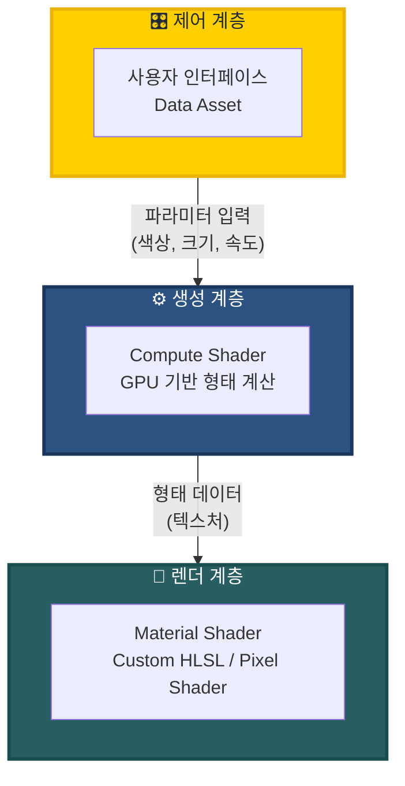

# 개요

<iframe width="681" height="383" src="https://www.youtube.com/embed/QUAofjz6ewg" title="Volumetric Aurora" frameborder="0" allow="accelerometer; autoplay; clipboard-write; encrypted-media; gyroscope; picture-in-picture; web-share" referrerpolicy="strict-origin-when-cross-origin" allowfullscreen></iframe>

_실제 사용 영상_

**Development**
- 기간: 7주
- 팀: Risk&Benefit (4인)
- 역할: **Flow Type 오로라 시스템 설계 및 구현** (벡터장 기반 유동 시뮬레이션)

**Team Members**
- [김민찬](https://github.com/mcminchan1021)
- [김진철](https://github.com/fuenell)
- [박선하](https://github.com/Sunha-i)
- [홍신화](https://github.com/budnarae)

**Volumetric Aurora**는 Unreal Engine 5에서 실시간으로 오로라를 생성하고 렌더링하는 플러그인이다. [Fab](https://www.fab.com/listings/57cba704-cfa8-4014-b6c2-b582822ce3fc)에 무료로 배포 중이다.

## 핵심 특징

**1. 입체적인 볼륨 렌더링**  
기존 2D 텍스처 방식과 달리 **레이 마칭**(카메라에서 광선을 발사해 공간을 탐색하는 기법)을 통해 3차원 공간에서 빛을 누적한다. 덕분에 어느 각도에서 봐도 자연스러운 입체감이 유지되며, 오로라가 겹치는 부분의 색상도 현실적으로 표현된다.

**2. 파라미터 기반 실시간 생성**  
사전 제작된 영상을 반복 재생하는 대신, 사용자가 설정한 파라미터로 매 프레임 형태를 계산한다. 형태와 움직임을 자유롭게 제어할 수 있어 다양한 연출이 가능하다.

**3. 세 가지 생성 방식**
- **Noise**: 절차적 노이즈로 생성하는 커튼형 오로라 (대규모 자연스러운 표현)
- **Spline**: 곡선 경로를 따라 형성되는 오로라 (정확한 형태 제어)
- **Flow**: 벡터장 기반으로 흐르는 오로라 (물결 같은 유동 표현)

자세한 사용법은 [공식 문서](https://riskandbenefit.github.io/VolumetricAurora_Docs/docs)에서 확인할 수 있다.

---

# 기술 구조

플러그인은 **제어 → 생성 → 렌더** 3단계로 동작한다.

## 1. 제어 계층

사용자 인터페이스를 통해 색상, 크기, 움직임 속도 등의 파라미터를 입력받아 생성 계층으로 전달한다.

![[9f88b53e643e49f83f5e0c3ca99e1e32_MD5.jpg | 500]]
_다양한 오로라 파라미터_

파라미터 조합을 Data Asset으로 저장하여 재사용할 수 있다.

![[a9514ec251d7cb27f2681c5668893a33_MD5.jpg | 500]]
_Data Asset 형태로 저장된 파라미터_

## 2. 생성 계층

전달받은 파라미터를 기반으로 **GPU Compute Shader**에서 오로라의 형태를 텍스처로 생성한다. 타입별로 서로 다른 알고리즘을 사용한다.

### Noise 타입

==Noise 타입은 알고리즘이 단순하여 예외적으로 렌더 계층에서 직접 처리되지만, 문맥상 생성 계층에서 설명한다.==

Simplex Noise를 서로 다른 UV 좌표로 두 번 샘플링한 뒤, 그 차이로 커튼과 같은 형태를 생성한다. UV 좌표 차이(offset)에 연속적인 변위를 적용하면 커튼 형상이 변화하여 마치 흔들리는 것 같은 애니메이션 효과를 줄 수 있다.

![[ae9880400900e9088b9ef28d46772b41_MD5.mp4]]

_Noise 타입 오로라 생성 과정. UV 좌표 변위에 따라 커튼 형상이 변화한다_

### Spline 타입

1. 오로라의 모양을 3차 베지어 곡선의 형태로 입력받는다.
2. 곡선을 여러 선분으로 분할한다.
3. 각 픽셀에서 가장 가까운 선분까지의 거리를 계산해 Distance Field 텍스처를 생성한다.

렌더 계층에서는 해당 공간이 곡선과 일정 거리 내에 있을 때만 오로라 입자를 축적함으로서 스플라인 오로라를 렌더링한다.

![[3ca2fcdb4a169526588bdf82d2dcc780_MD5.jpg | 500]]

_Distance Field 텍스처. 픽셀의 R값이 곡선으로부터의 거리를 나타내며, 거리가 가까울수록 어둡게 표시된다_

### Flow 타입

벡터장을 기반으로 유동성을 시뮬레이션한다.

1. 텍스처의 각 픽셀을 입자로 간주
2. 여러 제어점이 입자에 가하는 힘을 합산
3. 힘을 기반으로 새 위치 계산

**Double Buffering 기법**을 사용해 현재 위치를 읽는 Front Buffer와 새 위치를 저장하는 Back Buffer를 교체하며, 이전 프레임 정보를 유지하면서 연속적인 움직임을 보장한다.

<video width="500" autoplay loop muted playsinline>
  <source src="aa29967b217cf789208029a70d63c638_MD5.mp4" type="video/mp4">
</video> 

_Flow 타입의 Front Buffer 시각화. 벡터장의 영향을 받아 입자들이 실시간으로 이동한다_

## 3. 렌더 계층

**레이 마칭 기반 볼륨 렌더링**을 통해 오로라를 화면에 그린다.

카메라에서 각 픽셀 방향으로 광선을 발사하고, 일정 간격으로 전진하며 오로라 영역을 지날 때마다 색과 밀도를 누적한다. 각 타입에서 생성된 형태 데이터를 읽어 볼륨 렌더링을 수행한다.

![[1b46f6c42d2f3e4077770cbeffb569c6_MD5.jpg]]

_레이 마칭 원리. 카메라에서 발사된 광선이 일정 간격으로 샘플링하며 볼륨 데이터를 누적한다_

### 중첩 발광 처리

오로라가 여러 겹 겹치면 밝기가 과도하게 누적되어 하얗게 날아가는 문제가 발생한다. 이를 방지하기 위해 다음과 같은 처리를 수행한다:

**에너지 누적과 감쇠**

- 레이 마칭의 각 스텝에서 투과도를 기반으로 에너지를 누적
- 이전 스텝의 잔여 에너지를 고려하여 자연스럽게 감쇠
- 겹칠수록 무한정 밝아지는 대신, 점진적으로 증가 폭이 줄어듦

**톤 리매핑**

- 최종 밝기 분포를 정리하여 전체 밝기 범위를 안정화
- 형태는 또렷하게 유지하면서도 과포화를 방지

이를 통해 오로라가 겹치는 구간에서도 층위감과 깊이감이 유지된다.

---

# 결론

Volumetric Aurora는 GPU 기반 형태 생성과 레이 마칭 볼륨 렌더링을 결합한 오로라 시스템이다. 녹화된 영상 대신 절차적 생성 방식을 사용하여 색상과 형태를 실시간으로 제어할 수 있으며, 세 가지 생성 방식을 통해 다양한 오로라 연출을 지원한다.

특히 Flow 타입의 경우 벡터장 기반 시뮬레이션으로 기존에 구현하기 어려웠던 유동적인 오로라 표현을 실시간으로 구현했다.