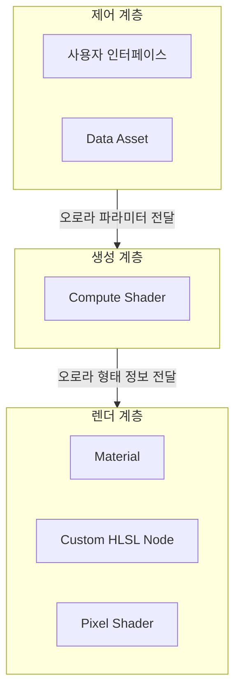

# 개요

<iframe width="681" height="383" src="https://www.youtube.com/embed/QUAofjz6ewg" title="Volumetric Aurora" frameborder="0" allow="accelerometer; autoplay; clipboard-write; encrypted-media; gyroscope; picture-in-picture; web-share" referrerpolicy="strict-origin-when-cross-origin" allowfullscreen></iframe>

_실제 사용 영상_

**Development**
- 기간: 7주
- 팀: Risk&Benefit (4인)

**Team Members**
- [김민찬](https://github.com/mcminchan1021)
- [김진철](https://github.com/fuenell)
- [박선하](https://github.com/Sunha-i)
- [홍신화](https://github.com/budnarae)

**프로젝트에서 맡은 역할** : Flow Type 오로라 구현

**Volumetric Aurora**는 Unreal Engine 5 환경에서 실시간으로 오로라를 생성하고 렌더링할 수 있는 플러그인이다. [Fab](https://www.fab.com/listings/57cba704-cfa8-4014-b6c2-b582822ce3fc)에 출시되었으며, 무료로 이용할 수 있다.

이 플러그인의 가장 큰 특징은 3차원 공간에서 빛을 누적하는 **레이 마칭** 기반의 볼륨 렌더링을 사용한다는 점이다. 이를 통해 시점에 독립적인 입체감을 구현할 수 있으며 오로라가 중첩되는 구간의 투명도도 자연스럽게 표현된다. 또한 사전 제작된 텍스처를 반복 재생하는 방식이 아니라 파라미터 기반의 실시간 생성 방식을 사용한다. 그 결과 형태와 움직임에 대한 제어 자유도가 크게 향상되었다.

다양한 형태의 오로라를 지원하기 위해 다음과 같은 세 가지 주요 타입을 제공한다:

- **Noise 타입**
    - 절차적 노이즈 기반
    - 커튼 형태
    - 자연스럽고 대규모 오로라 표현에 적합
- **Spline 타입**
    - 스플라인으로 형태를 직접 제어
    - 특정 경로를 따라 형성되는 오로라 연출 가능
- **Flow 타입**
    - 벡터장 기반 유동 표현
    - 물결처럼 흐르는 오로라 구현 가능

플러그인의 구체적인 사용 방법은 [공식 문서](https://riskandbenefit.github.io/VolumetricAurora_Docs/docs)를 통해 확인할 수 있다.

---

# 구현

Volumetric Aurora는 **제어 계층, 생성 계층, 렌더 계층**으로 나뉘어 동작한다.

## 제어 계층

==**제어 계층**은 사용자 인터페이스를 통해 오로라 관련 파라미터를 입력받아 **생성 계층**으로 전달하는 역할을 한다.==

![[9f88b53e643e49f83f5e0c3ca99e1e32_MD5.jpg | 500]]
_다양한 오로라 파라미터_

부가적으로, 파라미터 셋을 Data Asset의 형태로 저장/로드하여 편리하게 재사용할 수 있게 한다.

![[a9514ec251d7cb27f2681c5668893a33_MD5.jpg | 500]]
_Data Asset 형태로 저장된 Aurora 파라미터_

## 생성 계층

==**생성 계층**은 전달받은 파라미터를 기반으로 **오로라의 형태**를 텍스처로 Bake하는 역할을 수행한다.==

생성 계층은 높은 연산 성능을 확보하기 위해 GPU Compute Shader를 사용한다. 오로라 타입에 따라 서로 다른 알고리즘이 적용되며, 각 타입별로 독립적인 Compute Shader가 실행된다.  

Noise 타입은 형태 계산이 비교적 단순하여 별도의 패스를 거치지 않고, 최종 렌더 단계에서 직접 계산된다. 다만 설명의 일관성을 위해 다른 타입과 동일한 구조로 생성 방식을 기술한다.

타입별 생성 방식은 다음과 같다.

### Noise 타입

Simplex Noise 텍스처를 서로 다른 UV 좌표로 두 번 샘플링한 후, 두 샘플 값의 차이를 이용해 오로라의 기본 밀도 분포를 형성한다. 이를 통해 커튼처럼 흔들리는 대규모 오로라 형태를 생성한다.

### Spline 타입

Spline 컴포넌트를 기반으로 오로라의 형태를 정의한다.

1. 스플라인을 평면에 투영한 뒤 3차 베지어 곡선으로 보간한다.
2. 곡선을 여러 개의 직선 선분으로 분할한다.
3. 각 픽셀에서 가장 가까운 선분까지의 거리를 계산하여 Distance Field(DF) 텍스처를 생성한다.

이 과정은 GPU 컴퓨트 셰이더에서 수행되며, 실시간으로 거리장을 계산한다.

### Flow 타입

Flow 타입은 벡터장을 기반으로 오로라의 유동성을 계산한다.

1. 텍스처의 각 픽셀을 하나의 입자로 간주한다.
2. 제어점(Control Points)이 각 입자에 가하는 힘을 합산한다.
3. 계산된 힘을 기반으로 새로운 위치를 산출한다.

이때 Double Buffering 기법을 사용하여, 현재 위치를 읽는 Front Buffer와 새 위치를 저장하는 Back Buffer를 교체하며 실시간 갱신을 수행한다. Double Buffering을 통해 이전 프레임의 위치 정보를 유지하면서 새로운 위치를 계산할 수 있으며, 이를 통해 프레임 간 연속적인 유동성을 보장한다.

이와 같이 생성 계층은 각 타입별로 독립적인 알고리즘을 통해 오로라의 형태 데이터를 생성하고, 이를 렌더 계층으로 전달한다.

## 렌더 계층

### 레이 마칭 기반 볼륨 렌더링

이 플러그인의 핵심 렌더링 기법은 **Ray Marching**이다.

카메라에서 각 픽셀 방향으로 광선을 발사하고 일정 간격(step)으로 전진하면서 오로라 영역을 통과할 때마다 색과 밀도를 누적한다. AuroraMaterial은 각 타입에서 생성된 형태 데이터를 받아 볼륨 렌더링을 수행한다.

### 중첩 발광 제어

레이 마칭 과정에서는:

- 각 스텝의 **투과도 기반 에너지 누적**
- 이전 스텝의 잔여 에너지를 고려한 감쇠 처리
- 톤 리매핑을 통한 다이내믹 레인지 안정화

이를 통해 오로라가 겹치는 구간에서도 밝기가 과도하게 포화되지 않으며, 하얗게 뭉개지지 않고 층위감이 유지된다.

즉, 겹칠수록 단순히 밝아지는 것이 아니라  
**자연스럽게 감쇠되는 발광 분포**를 형성한다.

# 결론

Volumetric Aurora는 GPU 기반 형태 생성과 레이 마칭 볼륨 렌더링을 결합한 오로라 시스템이다. 
계층 구조를 통해 제어, 생성, 렌더링 과정을 명확히 분리하였으며, 정밀한 형태 제어와 유동 표현을 동시에 제공한다.